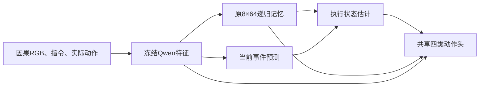

# 视觉事件证据与执行状态修正原型

本目录是版本化的新候选实现，状态 **UNTESTED**。它复用原 best4k 因果特征、8×64记忆和真实SEE2数据，既不修改正在运行的 `b2_kl_repair_v1`，也不将其阶段性低分充作本方法证据。当前用户授权终点是CPU准备完成、GPU阶段尚未启动。

当前CPU证据入口：[REPORT_ZH.md](runs/cpu_003/REPORT_ZH.md)、[CPU_TEST_RESULT.json](runs/cpu_003/CPU_TEST_RESULT.json)、[DATA_AUDIT.json](runs/cpu_003/DATA_AUDIT.json)。`cpu_001`保留CLI模块导入失败；`cpu_002`保留修正task_T掩码前的接口记录，不混入当前数据准入。三个CPU smoke模型不部署，也不接着训练成正式研究模型。

## 具体方法与强对照

三个模式共享所有初始参数、动作头、事件监督、精确状态监督、原完整KL和普通动作CE。`DIRECT` 是强简单替代：从递归记忆直接预测四位状态，并把预测状态输入动作。它比只用辅助loss的旧B2更直接，不能故意做弱。

`MONOTONIC` 使用当前两张RGB/指令/已执行动作所形成的冻结特征预测两种SEE2事件，累积“曾完成前置事件”的信念。`REVISE` 额外允许模型根据同一因果记忆及当前事件证据降低错误的旧信念。这里修改的是对历史的估计，不是让真实已完成事件失效。

令上一时刻预测为 b，当前事件预测为 e_a、e_t，修正门为 r：

```
MONOTONIC: p = b
REVISE:    p = b * (1-r)
after = p + (1-p) * e_a
z = [p, after, e_t, p * e_t]
final_logits = existing_action_logits + W_state(z)
```

初始 p 由同一因果指令特征学习，因此task_T不需要在运行时输入任务ID、程序状态或oracle。两个事件同时首次出现不能满足“前置事件早于终点”的旧定义。概率只是模型输出，未证明校准；乘法组合也不是一般条件相关事件的精确贝叶斯推断。

新增动作项从零初始化，各臂起始动作与旧共享初始化完全相同。DIRECT/MONOTONIC/REVISE注册参数数量一致，但活跃梯度范围不同；日志如实记录，不能以参数总数相同声称有效容量完全相同。三臂事件loss和状态loss均存在，未来实验的主要变化是执行状态的形成方式。



actor仍保留原空间/历史记忆路径；不能仅凭状态项非零声称已隔离出唯一任务变量。未来必须做正确/错误/匹配状态替换、无关task_T和普通导航回归。现在不增加置信阈值搜索、在线程序解析、未来query或真值输入。

## 真实资产与信息边界

`prepare.py` 从原完整物理轨迹调用只读Compiler重算当前SEE2事件和四位状态；UNKNOWN有独立mask。task_T指令没有指定anchor，因此还屏蔽其anchor事件监督，避免要求模型猜测未告知的角色。所有原有失败和旧training_admission原样保留。物理轨迹、父族、派生窗口分别计数；现有开发屋已暴露，不改名为TEST。

部署路径只接受2048维因果特征、原生四类logits及自己的有限状态。Compiler、实例ID、位姿、碰撞、未来query、标签和分割ID均不进入`step()`。`runtime.py`要求动作先提交再处理下一观测，STOP和运动都占500预算，STOP不会额外调用观测。

继承缓存来源已记录在BINDING，但本轮没有重新加载2B底模或现场核验数值路径。CPU smoke权重只能调试，不能作为未来1200步比较的初始化。恢复校验绑定mode、seed、输入、设备和目标更新数，拒绝把3步CPU smoke接成正式训练。

## 已有方法及贡献表述

- [Noisy Symbolic Abstractions / RMSM](https://arxiv.org/html/2211.10902v2)，方法4–5节：从历史学习任务状态信念、让策略使用预测状态，以及事件独立累积的局限都已有直接先例。DIRECT据此作为概念上的强替代，不声称这里复现了其RL实验。
- [Progress-Think](https://arxiv.org/abs/2511.17097)：语义进度进入导航策略已有先例。本轮读论文入口/摘要，未复现其模型。
- [Instruction-as-State](https://arxiv.org/abs/2604.18223)：随观测更新指令状态已有先例。本轮核查摘要，不主张“任务条件状态”本身新颖。
- 源码复用的是本仓库`pilot/model.py → query_reader_repair_v2 → contextual_readout_v10 → query_semantics_v11`和V16初始化/批次/检查器，具体SHA见绑定。未复制上述论文的实现代码。

候选增量仅是：在视觉事件误检/漏检及重复证据下，可修正的执行状态是否比直接学习状态和只累积事件更有利于闭环动作。该门控形式本身是普通神经网络设计，不作理论原创或“首次”主张；只有匹配闭环收益、机制证据和适用范围成立，才能讨论方法贡献。若DIRECT同样好或更好，优先简单方法。

[CVPR 2026官方审稿指南](https://cvpr.thecvf.com/Conferences/2026/ReviewerGuidelines)强调技术可靠与实际贡献，并未要求每篇论文刷新SOTA；但不抄袭只是基本要求，不足以保证录用。本轮无法读取2027同名指南，2026规则只作为已核实参考，投稿时按目标年份更新。这里没有“保证审稿人不质疑”或录用承诺。

## 当前可执行入口

项目Python路径见`PROTOCOL.json`。在本目录运行，CPU阶段不占GPU：

```bash
CUDA_VISIBLE_DEVICES='' /mnt/data_nas/deeprobotics/daiyang/vla/projects/qwen35_indoor_nav/.envs/q35n_qwen_g2_v1/bin/python3 -I -B cpu_pipeline.py --run runs/cpu_003
```

CPU入口依次完成数据准备、契约、三臂各3步真实FIT更新与报告，并停在`READY_FOR_GPU_STAGE_NOT_LAUNCHED`。使用`standalone.py start NAME -- ABSOLUTE_PYTHON -I -B ABSOLUTE_CPU_PIPELINE`可独立运行，JOBS只写本目录。已完成的CPU产物不自动覆盖。

当前独立服务为`q35n-evidence-state-cpu-20260921-03.service`；运行状态见`standalone_jobs/evidence-state-cpu-20260921-03/STATUS.json`。现有GPU测试服务没有被暂停或改写。数据审计中事件计数的`unknown`桶表示mask为0，包含task_T未指定的anchor角色；它不代表这些旧物理记录新增了UNKNOWN结果，标签结果与监督适用性分开解释。

`train.py --run PATH --output NEW_PATH --mode {DIRECT,MONOTONIC,REVISE} --seed 1209 --device cuda:0 --updates 1200`是下一GPU阶段的单模型入口，支持`--resume`恢复完整优化器和RNG；本轮未执行。正式GPU阶段需先确认设备与固定资源预算，再从共享初始state启动，不能从CPU smoke继续。

下一步还需将此runtime状态结构接入真实续接服务并做缓存/现场审计，再开始完整配对评测。适配器CPU通过不是Habitat已接通；新方案的导航执行尚未注册/启动。独立多屋、自然VLN、误检后学习纠错与部署性能都是后续证据缺口，不用现有DEV小样本替代。
