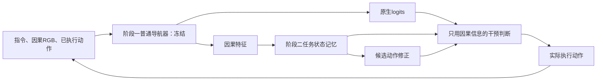

# 普通导航保真约束下的任务状态适配

状态：候选研究方案；CPU接口与只读动作诊断已执行，新的两阶段方法尚未训练或闭环验证。2026-09-22。当前100000步长训及5000步间隔评测不受本目录影响。

建议采用用户提出的两阶段开发，但把论文问题明确为：给已有导航器增加历史敏感任务能力时，如何获得更多有用修正，同时减少对原有正确行为的干扰。B2/精确任务状态可以作为方法组件；无需坚持原交叉结果辅助loss必须击败B2。已有合法交叉续接资产可用于监督、对照与诊断，其用途和贡献应据实区分。

学术贡献可以是方法改进、严格的数据构造和有解释力的实证发现，不要求凭空发明所有组件。CVPR官方评审指引要求技术可靠与知识增量，并不把没有超过某个已有SOTA直接等同于拒稿；这也不保证特定方案获接收或不受质疑。[CVPR 2026评审指引](https://cvpr.thecvf.com/Conferences/2026/ReviewerGuidelines)。投稿年份的规则需在实际投稿时再次核对。

## 先说明本地依据

当前 `EvidencePolicy.step` 每步输出 `core.action_logits(...) + state_action(probability)`；其中 `MemoryPolicy.action_logits` 已经是原生logits加记忆残差。普通动作CE与保留KL已经存在。因而当前并非缺少“冻结基座”或“蒸馏”，缺少的是区分有益修正与有害修正的可靠闭环控制机制。

本次按原顺序固定取同一旧普通CHECK房屋8WUmhLawc2A的8条轨迹（索引101–108），只读两个已保存head，在同一缓存上检查464个教师强制动作。统计见 `OFFLINE_AUDIT.json`：

|候选|符合教师动作|原生不符→符合|原生符合→不符|相对原生动作翻转|
|---|---:|---:|---:|---:|
|best4k缓存原生|343/464|—|—|—|
|EXPANDED 1200|355/464|46|34|86|
|EXPANDED 5000|362/464|51|32|89|

这是存在“有效改动与干扰同时发生”的局部动作证据，为研究选择性介入提供动机。教师动作不是唯一合法动作；这些数目不是SR，也不能把51次改善直接当作可被路由器全部识别的收益上限。8条旧CHECK轨迹不代表完整数据集，不据此挑阈值或宣布新方案有效。禁用适配输出的464个logits均与输入原生logits完全相等；这是旁路接口性质，尚不是自动路由保留普通导航的实验。

此外，现有扩展数据的真实历史以原地左/右转为主，学习SEE2事件与合法STOP；不能据此宣称已覆盖普通VLN的前进、门口转向、跨房屋路线与偏航恢复。当前保留best4k的普通INTERNAL_DEV100条SR21%是旧记录，并非本方案新测量。

## 两阶段实现

**阶段一：训练普通导航器。** 使用原始R2R/RxR普通训练资产，沿现有Qwen3.5-2B `PolicyV3`、LoRA及四类动作接口训练与验证；正常前进、转向、STOP及失败恢复都需评估。checkpoint只能用普通开发集选择，随后冻结底模、LoRA、动作头、执行动作嵌入、action query、processor与数值路径。冻结的是完整执行器，不只是某些可训练张量。阶段一不因特殊任务分数选择权重，也不自动长训到任意目标。

**阶段二：训练可旁路的任务状态适配器。** 冻结阶段一执行器π0，因果特征f_t输入现有8×64记忆，学习任务条件事件/状态与候选动作修正。新增轻量路由器仅使用指令条件特征、已执行历史形成的记忆、预测状态及原生logits，判断是否采用候选动作。私有任务检查器、未来续接、距离、场景ID与split ID只用于离线审核，不能成为路由输入。

部署选择为：g_t=0时返回原生logits；g_t=1时返回候选logits。候选可改变STOP；不能通过永远强制原生STOP来伪造原生能力保持。实际执行的动作进入两路的下一步历史；episode/通道独立reset，指令变化重新计算任务条件记忆。训练期可用soft gate提供梯度，但正式推理的硬选择规则须提前固定并对照，不能忽略soft/hard差异。

新普通基座若发生任何参数或processor变化，必须重新生成所有对应因果特征缓存；当前100k记忆head不能未经重训练/兼容性验证直接接入新基座。`interface.py`只实现候选路由接口和分支监督字段校验，未接入活跃运行器，未训练有效的gate。

## 可争取的方法贡献

工作名：**Task-State Adaptation with Navigation Retention**，仅用于描述，不宣称新范式或已证实创新。

候选增量是把“需要记住什么”与“这条记忆是否值得改变当前动作”分开学习，并用真实配对执行监督后一问题。仅有B2精确状态不能自动回答：原生动作在这个状态是否已经足够好？仅有与教师动作不一致，也不能证明改动提高了最终任务满足。

未来可生成以下干预证据：从同一真实已执行前缀分别重放，分支0首先执行π0原生动作，分支1首先执行预先登记的候选动作；后续都使用同一冻结π0，环境/初始状态/指令/随机性/剩余预算相同。分别实际执行并检查任务满足，得到候选动作对这项有限续接的结果差Δ。不要复制logits、传送历史或用“应该能成功”造标签。

- 分支1通过而分支0失败：该登记分支有正收益。
- 分支1失败而分支0通过：明确的有害干预。
- 两者相同：当前分支未测得成功率增量，不能推为所有动作/续接全局等价。
- 不完整、非法或证据不足：mask，不能统一负例。

已有三个固定教师续接并不等于上述原生/候选动作分支；当前并没有完整的这类门控训练集。首动作后共同执行π0只是有限诊断，可能无法发现需多次修正才成功的案例；若大量两支均失败，要报告它的支持集不足，不能把结果当作记忆无用。多步选项或其他续接策略需另行版本化，不能事后改变标签问题。

训练目标仍保留普通动作回放与原生蒸馏，以精确组合式任务状态训练记忆；路由器额外学习实测干预收益及有害干预。动作、状态、路由目标分别按有效样本/族归一化；相同数据池、初始化、更新数和普通样本曝光给全部强对照。不能再把“加KL”本身当新修复，因为当前源码已有KL。

候选算法贡献是这种针对历史任务的干预监督与普通行为约束如何联合产生更好的收益—退化折中；数据贡献是可回放的有益/有害/无收益分支与任务无关控制；实证贡献是定位原有成功为何丢失并减少它。三者都需要实际比较，当前只有动机与接口。

## “不影响普通导航”分三层

|说法|可以怎样成立|不能据此推出什么|
|---|---|---|
|原生权重不变|完整参数/buffer和processor身份核验|组合策略动作或SR不变|
|显式禁用模块后不变|同输入精确返回原生logits；相同随机性/环境下逐步验证|自动路由能正确识别所有普通任务|
|统一策略普通能力保留|让模块正常启用，在完整普通闭环上检验配对SR/SPL/nDTW和原有成功保留|未测场景绝对零退化|

显式普通/特殊任务开关可以用于产品兼容路径与强基线；若测试时用数据集ID帮模型关模块，不得包装成统一策略自动无遗忘。主要科学主张采用经验非劣性，不宣称全局保证。容忍幅度及样本量在正式测试前固定，例如讨论0或1个百分点的普通SR退化容限时，必须同时说明检测该差值需要的房屋/episode数量；目前未冻结阈值，也不把100条开发轨迹当足以证明1个百分点非劣性的样本。

普通任务除净ΔSR，还报告原生成功被破坏数、原生失败被修复数、动作介入率和首次有害分歧；零净差也可能掩盖大量成功互换。任务T只是不依赖某锚点历史的受控任务，不能代替完整自然R2R测试。

## 必要强对照与最小推进顺序

|对照|用途|
|---|---|
|普通π0|原生闭环基线|
|B2/现有MONOTONIC全时修正＋普通回放/KL|最直接的状态适配基线|
|同容量当前窗口门控，不用历史|排除只靠当前画面或模板分类|
|B2＋原生置信度门控 / 教师分歧门控|检验真实干预监督是否优于简单门控；与主方法共享物理轨迹池|
|只在STOP处修正|排除收益只是终止偏置|
|显式任务路由／普通时禁用|兼容性强基线，披露额外已知任务模式；不混入统一路由结果|
|完整候选＋正确/错误/sham记忆|验证策略确实利用任务相关旧历史|

第一小步先比较“全时B2适配、简单门控、干预监督门控”，不同时启动大矩阵。所有普通与特殊样本按真实房屋、整段轨迹、历史族和语言族隔离；当前已暴露四屋/普通CHECK只能用于开发，后续独立测试在选择冻结后进行。核心机制子集需要相同当前窗口/任务、不同可观察旧事件，且有与后续任务相关的合法行为差异；原地样本只能支持原地任务结论。

下一轮造数优先补普通前进与偏航恢复场景中的原生保留/有害干预/有益干预，而不是只继续增加同型原地旋转族数量。阶段一基座训练和阶段二干预造数、训练都尚未在本轮启动；这不阻止先完成CPU接口和真实资产清单。

支持这条路线需要：新增历史任务的完整闭环收益、普通导航的预注册非劣性、优于简单门控的配对证据和可接受成本。若只有禁用模块才能保留普通SR，保留工程双模式价值，不宣称统一策略贡献；若简单门控一样好，采用简单方法，不继续为更复杂模块编造必要性。即便改进成立，也只声明测试范围内的知识增量，不承诺CVPR接收。

## 先例及边界

冻结网络加旁路在[Side-Tuning](https://sidetuning.berkeley.edu/)中已有系统研究，并含Habitat导航；新任务训练保留旧能力与蒸馏有[Learning without Forgetting](https://arxiv.org/abs/1606.09282)；在已有控制器上学修正有[Residual Policy Learning](https://arxiv.org/abs/1812.06298)。所以这几个组件都不列为首创。

[Progress-Think](https://arxiv.org/html/2511.17097v2)已将语义进度与导航结合并分阶段训练；[Instruction-as-State](https://arxiv.org/abs/2604.18223)研究随环境更新的指令状态；[VLNCL](https://arxiv.org/abs/2409.02561)研究VLN持续学习和记忆回放。必须按这些具体对象比较，而不是把“状态”“记忆”“两阶段”重新命名。

[SPIBB](https://proceedings.mlr.press/v97/laroche19a.html)已有相对基线的保守策略改进思想和特定假设下的保证。本方案未满足其证明条件，不能引用它来声称部分可观测VLN上的零退化定理。这里的差异候选在真实任务历史、干预标签与两类闭环结果的联系，仍待实现和实证。

本轮访问了上述一手论文/项目入口；Progress-Think读取方法段及官方ActionModel/ProgressModel两个薄封装，未端到端复现官方系统。源码、权重可用性和同协议实验成本需在实际对照前进一步核验。检索不构成“全球无同构先例”的证明。
